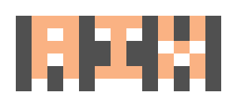

<p align="center">
  <br />
  <br />
  <br />
  <strong>AI eXchange</strong><br />
  <sub>All your AI tools, one place.</sub>
</p>

<p align="center">
  <a href="https://github.com/ihxnnxs/aix/releases"></a>
  <a href="https://github.com/ihxnnxs/aix/actions"></a>
  <a href="https://github.com/ihxnnxs/aix/blob/main/LICENSE"></a>
</p>

<p align="center">
  <a href="README.ru.md">Русский</a> · <a href="README.zh.md">中文</a> · <a href="README.ja.md">日本語</a> · <a href="README.ko.md">한국어</a>
</p>

---

Transfer MCP servers and rules between AI coding tools through an interactive TUI. Supports 21 tools with both global and project-scoped configurations.

## Install

```bash
curl -fsSL https://raw.githubusercontent.com/ihxnnxs/aix/main/install.sh | bash
```

## Usage

```bash
aix              # Launch interactive TUI
aix list         # View MCP servers and rules across tools
aix transfer     # Transfer between tools
aix doctor       # Diagnose CLI tool detection
```

## Supported Tools

| Tool | MCP Global | MCP Project | Rules |
|------|:----------:|:-----------:|:-----:|
| Claude Code | ✓ | ✓ | ✓ `CLAUDE.md` |
| Claude Desktop | ✓ | | |
| Cursor | ✓ | ✓ | ✓ `.cursorrules` |
| VS Code | ✓ | ✓ | ✓ `copilot-instructions.md` |
| Windsurf | ✓ | | ✓ `.windsurfrules` |
| Cline | ✓ | | ✓ `.clinerules` |
| Roo Code | ✓ | ✓ | ✓ `.roo/rules/` |
| Kilo Code | ✓ | ✓ | ✓ `.kilo/rules/` |
| TRAE | ✓ | ✓ | ✓ `project_rules.md` |
| OpenCode | ✓ | ✓ | ✓ `AGENTS.md` |
| Qwen Code | ✓ | ✓ | ✓ `AGENTS.md` |
| Claude for IDE | ✓ | | |
| Droid | ✓ | ✓ | ✓ `.factory/` |
| Goose | ✓ | | ✓ `.goosehints` |
| Crush | ✓ | ✓ | ✓ `AGENTS.md` |
| Eigent | ✓ | | |
| Gemini CLI | ✓ | ✓ | ✓ `GEMINI.md` |
| Amazon Q | ✓ | ✓ | ✓ `.amazonq/rules/` |
| Amp | ✓ | ✓ | ✓ `AGENT.md` |
| Codex CLI | ✓ | ✓ | ✓ `AGENTS.md` |
| Copilot CLI | ✓ | | ✓ `copilot-instructions.md` |

## Features

- **MCP Transfer** — select MCP servers from one tool, transfer to another with automatic format adaptation
- **Rules Transfer** — transfer rules/instructions between tools (`.cursorrules` ↔ `CLAUDE.md` ↔ `.clinerules` etc.)
- **Project scope** — run `aix` inside a project to manage both global and project-scoped configs
- **Auto-detect** — scans your system for installed AI tools and reads their configurations
- **Themes** — 5 built-in themes (Default, Dracula, Monokai, Gruvbox, Nord)
- **Languages** — English, Русский, 中文, 日本語, 한국어
- **Update checker** — notifies you when a new version is available
- **Backups** — configs are backed up before any changes (`~/.config/aix/backups/`)

## Development

```bash
bun install
bun run dev          # Run in dev mode
bun test             # Run tests
bun run build        # Build cross-platform binaries
```

## License

MIT
